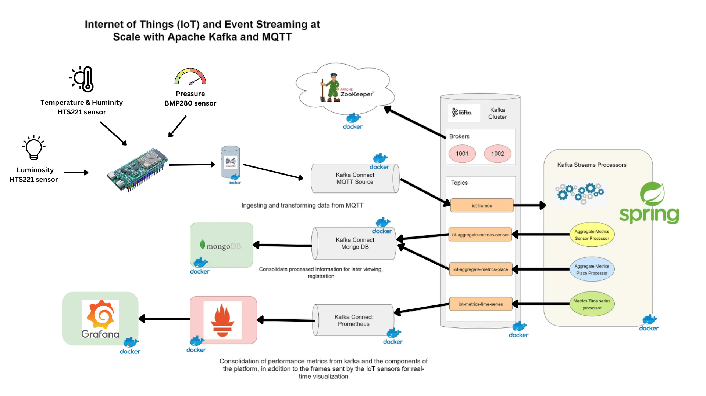

assignment00

# Main technologies of architecture

## Architecture Overview

## Eclipse Mosquitto
Eclipse Mosquitto เป็นซอฟต์แวร์โอเพนซอร์ส ทำหน้าที่เป็นตัวกลางส่งข้อความซึ่งนำมาใช้งานกับโปรโตคอล 
MQTT ตัว Mosquitto มีนำ้หนักเบาเหมาะสำหรับการใช้งานบนอุปกรณ์ทุกประเภท มีการใช้โปรโตคอล MQTT ที่มีวิธีการส่งข้อความผ่านโมเดล
publish/subscribe model ทำให้เหมาะสมกับการส่งข้อความใน Internet of Things เช่น การใช้งานร่วมกับ
เซ็นเซอร์ที่ใช้พลังงานต่ำหรืออุปกรณ์เคลื่อนที่เป็นต้น

## Apache ZooKeeper
Zookeeper เป็นตัวควบคุม service ทั้งหมดตั้งแต่การบริการศูนย์กลางที่ช่วยในการดูแลการตั้งค่า, การตั้งชื่อ, การ synchronization และบริการ
กลุ่มสำหรับแอปพลิเคชันแบบกระจาย ซึ่งช่วยลดความซับซ้อนและปัญหาที่เกิดจากการพยายามนำบริการเหล่านี้ไปใช้เองในแอปพลิเคชันแต่ละตัว.

## Apache Kafka
Apache Kafka เป็นแพลตฟอร์มสำหรับการส่งข้อมูลแบบเรียลไทม์ที่สามารถจัดการและกระจายข้อมูล
จำนวนมหาศาลไปยังผู้ใช้หลายคนพร้อมกันได้ 

## Apache Kafka Connect
Kafka Connect เป็นเฟรมเวิร์คสำหรับเชื่อมต่อ Kafka กับระบบภายนอก ตัว Kafka Connect มุ่งเน้นไปที่การสตรีมข้อมูลไปและกลับจาก Kafka 
ทำให้ง่ายขึ้นในการเขียน connector plugins ที่มีคุณภาพสูง Kafka Connect เป็นส่วนสำคัญของสายงาน ETL เมื่อรวมกับ Kafka และ
เฟรมเวิร์คที่มีการประมวลผลสตรีม

## Apache Kafka Streams
Kafka Streams เป็นไลบรารีสำหรับสร้างแอปพลิเคชันและ microservices ที่สามารถประมวลผลและวิเคราะห์
ข้อมูลแบบเรียลไทม์ ได้โดยใช้ข้อมูลจาก Cluster ตัว Apache Kafka ช่วยให้การพัฒนาแอปพลิเคชัน Java 
และ Scala ง่ายขึ้น

## Prometheus
Prometheus เป็นซอฟต์แวร์ที่ใช้สำหรับการตรวจสอบเหตุการณ์และแจ้งเตือน Prometheus สามารถบันทึก
ค่าแบบเรียลไทม์ในฐานข้อมูลแบบ time series โดยใช้โมเดลการดึงข้อมูลผ่าน HTTP มีการค้นหาที่
ยืดหยุ่นและการแจ้งเตือนแบบเรียลไทม์ 

## MongoDB
MongoDB เป็นระบบฐานข้อมูล NoSQL ที่เป็นโอเพนซอร์ส แทนที่จะจัดเก็บข้อมูลในตารางเหมือนฐานข้อมูล
เชิงสัมพันธ์ MongoDB จะบันทึกโครงสร้างข้อมูล BSON (คล้าย JSON) พร้อมกับที่ dynamic schema ทำให้
การรวมข้อมูลในบางแอปพลิเคชันง่ายและรวดเร็วขึ้น 

## Grafana
Grafana คือ dashboard tools ไว้สำหรับการแสดงผลข้อมูลต่างๆ โดยสามารถรับข้อมูลจาก datasource(Prometheus) ได้แบบ realtime 
ช่วยให้สามารถสร้าง Dashboard และกราฟจากแหล่งข้อมูลหลายประเภทและสามารถดูค่าได้แบบ realtime

## IOT Sensor

เป็น Service ที่ได้ค่าเซนเซอร์จากการสุ่มผ่าน Spring Boot และได้ค่ามาจาก Board Cucumber โดยส่งค่า Sensor ผ่าน MQTT Protocol
