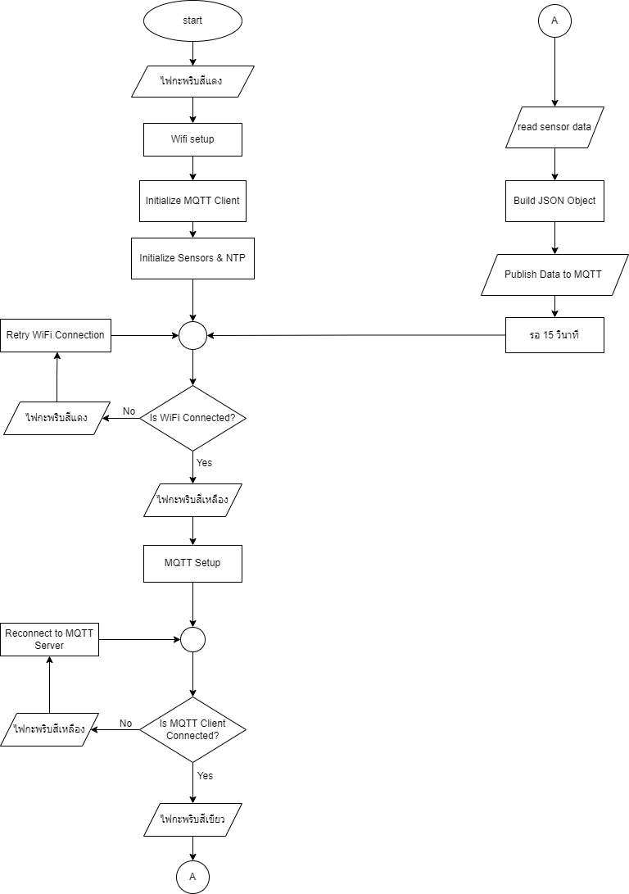

# Ingest and store real-time data from IoT sensors.
>> ใช้ software อะไรบ้าง เช่น Eclip MQTT , Microsoft spring boot

ในการดึงและจัดเก็บข้อมูลแบบเรียลไทม์จากเซนเซอร์ IOT ขั้นตอนแรกคือการเก็บข้อมูลโดยใช้ protocal ของ MQTT ซึ่งเหมาะกับอุปกรณ์ IoT ข้อมูลจะถูกส่งไปยัง steaming plattform เช่น Apache Kafka ซึ่งสามารถจัดการกับข้อมูลแบบเรียลไทม์ได้ จากนั้นข้อมูลจะถูกส่งต่อไปยังเฟรมเวิร์กในการประมวลผลแบบเรียลไทม์ และข้อมูลที่ประมวลผลเสร็จแล้วจะถูกเก็บในฐานข้อมูลได้ เช่น MongoDB

## MQTT Topic and Payload
>> ใช้ topic ชื่ออะไร payload มีหน้าตาอย่างไร

// topic //
client.subscribe("iot-frames");

// Payload //
doc["id"] = "43245253";
doc["name"] = "iot_sensor_3";
doc["place_id"] = "42343243";
doc["date"] = NTP.getTimeDateString(time(NULL), "%Y-%m-%dT%H:%M:%S");
doc["timestamp"] = epochTime; // Convert to milliseconds
doc["payload"]["temperature"] = temperature;
doc["payload"]["humidity"] = humidity; // Update with correct humidity reading
doc["payload"]["pressure"] = p;
doc["payload"]["luminosity"] = ldrValue;

## ESP32
>> เอา code ที่ใช้มาวาง พร้อมทั้งวาดรูป flow chart
```
#include <Wire.h>
#include <Adafruit_Sensor.h>
#include <Adafruit_BMP280.h>
#include <SensirionI2cSht4x.h>
#include <Adafruit_HTS221.h>
#include <Adafruit_MPU6050.h>
#include <PubSubClient.h>
#include <WiFi.h>
#include <ArduinoJson.h>
#include <WiFiUdp.h>
#include <ESPNtpClient.h>
#include <Adafruit_NeoPixel.h>

// WiFi credentials
const char* ssid = "TP-Link_CA30";
const char* password = "29451760";

// MQTT Broker settings
const char* mqtt_server = "172.16.46.66";
const int mqtt_port = 1883;
const char* mqtt_user = "iot-wangs-13"; // Replace with your MQTT username if needed
const char* mqtt_password = "12345"; // Replace with your MQTT password if needed

const PROGMEM char* ntpServer = "172.16.46.66";

#define NTP_TIMEOUT 5000

// MQTT Clients
WiFiClient espClient1;
PubSubClient client1(espClient1);

// Sensors
Adafruit_BMP280 bmp;
SensirionI2cSht4x sht4x;
Adafruit_HTS221 hts;
Adafruit_MPU6050 mpu;

// LED pin
const int ledPin = 18;

// LDR pin
const int ldrPin = 5;  // GPIO5 for LDR

// NeoPixel setup (assuming 1 pixel on the board)
#define PIN 18
#define NUMPIXELS 1
Adafruit_NeoPixel pixels(NUMPIXELS, PIN, NEO_GRB + NEO_KHZ800);

// Function to set RGB color
void setRGBColor(uint8_t r, uint8_t g, uint8_t b) {
  pixels.setPixelColor(0, pixels.Color(r, g, b));
  pixels.show();
}

// Status functions
void setStatusConnecting() {
  setRGBColor(255, 255, 0); // Yellow
  delay(200);  // Wait for 200ms (or any duration you prefer)
  setRGBColor(0, 0, 0);  // Turn off LED
  delay(200);  // Wait for 200ms (or any duration you prefer)
}

void setStatusConnected() {
  setRGBColor(255, 0, 0); // Green
}
void setStatusDisconnected() {
  while (WiFi.status() != WL_CONNECTED) {  // Keep blinking as long as WiFi is disconnected
    setRGBColor(0, 255, 0);  // Set to red
    delay(500);  // Wait for 500ms
    setRGBColor(0, 0, 0);  // Turn off LED
    delay(500);  // Wait for 500ms
  }
}
void setStatusSending() {
  setRGBColor(0, 255, 255);  // Set to purple
  delay(200);  // Wait for 200ms (or any duration you prefer)
  setRGBColor(0, 0, 0);  // Turn off LED
  delay(200);  // Wait for 200ms (or any duration you prefer)
}

void setStatusEmpty() {
  setRGBColor(0, 0, 0);  // Turn off LED
}

// MQTT callback function
void callback(char* topic, byte* payload, unsigned int length) {
  Serial.print("Message arrived [");
  Serial.print(topic);
  Serial.print("] ");
  
  String message;
  for (int i = 0; i < length; i++) {
    message += (char)payload[i];
  }
  Serial.println(message);

  // Parse JSON
  StaticJsonDocument<200> doc;
  DeserializationError error = deserializeJson(doc, message);
  
  if (error) {
    Serial.print("deserializeJson() failed: ");
    Serial.println(error.f_str());
    return;
  }

  const char* sensor_name = doc["name"];

  // Check if the sensor name is "iot-wangs-13"
  if (strcmp(sensor_name, "iot-wangs-13") == 0) {
    Serial.print("----------------------------Filtered message: ");
    Serial.println(message);
  }
}

void setup_wifi() {
  delay(10);
  IPAddress ip(172, 16, 46, 67);  // Desired IP address
  IPAddress gateway(172, 16, 46, 254);  // Default gateway IP address
  IPAddress subnet(255, 255, 255, 0);  // Subnet mask
  
  Serial.println();
  Serial.print("Connecting to ");
  Serial.println(ssid);

  WiFi.config(ip, gateway, subnet);  // Set static IP configuration

  WiFi.begin(ssid, password);

  // Set RGB to red while waiting to connect
  setStatusDisconnected();

  while (WiFi.status() != WL_CONNECTED) {
    delay(500);
    Serial.print(".");
  }

  // Set RGB to green once connected
  setStatusConnected();

  Serial.println("");
  Serial.println("WiFi connected");
  Serial.print("IP address: ");
  Serial.println(WiFi.localIP());
}

void reconnect() {
  // Loop until we're reconnected to the broker
  while (!client1.connected()) {
    Serial.print("Attempting MQTT connection to broker 1...");
    setStatusConnecting();
    if (client1.connect("client1", mqtt_user, mqtt_password)) {
      Serial.println("connected to broker 1");
      client1.subscribe("iot-frames");
      setStatusConnected();
    } else {
      Serial.print("failed, rc=");
      Serial.print(client1.state());
      Serial.println(" try again in 5 seconds");
      setStatusDisconnected();
    }
    
    delay(5000);
  }
}

void setupHardware() {
  Wire.begin(41, 40, 100000);
  if (bmp.begin(0x76)) {
    Serial.println("BMP280 sensor ready");
  }

  sht4x.begin(Wire, 0x44);
  Serial.println("SHT4x sensor initialized");

  if (mpu.begin(0x68)) {
    Serial.println("MPU6050 sensor ready");
  } 

  pinMode(ledPin, OUTPUT);
  digitalWrite(ledPin, HIGH); 

  pinMode(ldrPin, INPUT);  // prepare LDR

  pixels.begin(); // Initialize NeoPixel
}

void setup() {
  Serial.begin(115200);
  setupHardware();
  setup_wifi();
  client1.setServer(mqtt_server, mqtt_port);
  client1.setCallback(callback);

  NTP.setTimeZone(TZ_Asia_Bangkok);
  NTP.setInterval(600);
  NTP.setNTPTimeout(NTP_TIMEOUT);
  NTP.begin(ntpServer);

  Serial.println("Starting!!!");
}

unsigned long Get_Epoch_Time(){
  time_t now;
  struct tm timeinfo;
  if (!getLocalTime(&timeinfo)) {
    return 0;
  }
  time(&now);
  return now;
}

void loop() {
  if (WiFi.status() != WL_CONNECTED) {
    setStatusDisconnected();
    setup_wifi();  // Attempt to reconnect to Wi-Fi
  }

  if (!client1.connected()) {
    reconnect();
  }

  client1.loop();

  static uint32_t prev_millis = 0;
  const size_t capacity = JSON_OBJECT_SIZE(6) + 200; // Adjust capacity as needed
  StaticJsonDocument<capacity> doc;

  if (millis() - prev_millis > 15000) {
    prev_millis = millis();

    float p = bmp.readPressure();
    int ldrValue = analogRead(ldrPin); // Read LDR value from GPIO5

    float temperature, humidity;
    int16_t error = sht4x.measureHighPrecision(temperature, humidity);
    if (error) {
      Serial.print("Error trying to execute measureHighPrecision(): ");
      Serial.println(error);
    } else {
      unsigned long epochTime = Get_Epoch_Time();
      
      // Payload
      StaticJsonDocument<capacity> doc1;
      doc1["id"] = "43245253";
      doc1["name"] = "iot-wangs-13";
      doc1["place_id"] = "42343243";
      doc1["date"] = NTP.getTimeDateString(time(NULL), "%Y-%m-%dT%H:%M:%S");
      doc1["timestamp"] = epochTime; // Convert to milliseconds
      doc1["payload"]["temperature"] = temperature;
      doc1["payload"]["humidity"] = humidity; // Update with correct humidity reading
      doc1["payload"]["pressure"] = p / 100;
      doc1["payload"]["luminosity"] = ldrValue;

      // Serialize JSON to char array for payload
      char jsonBuffer1[capacity];
      serializeJson(doc1, jsonBuffer1);

      // Publish JSON to MQTT broker 1
      client1.publish("iot-frames", jsonBuffer1);
      setStatusSending();
    }
  }
  delay(1000);
}
```

